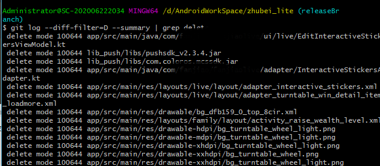
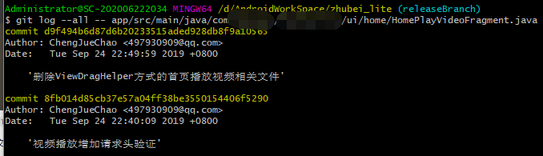
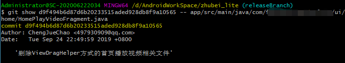
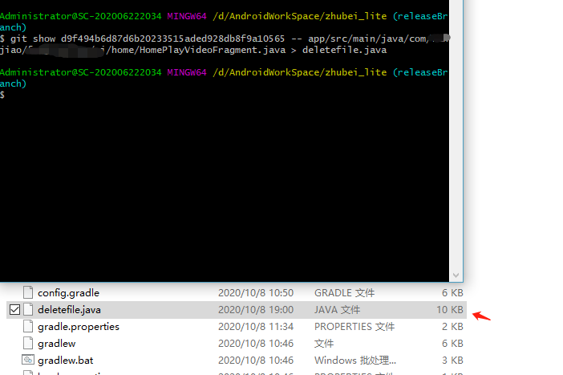

- 查看首页删除文件的历史记录`git log --diff-filter=D --summary | grep delete`

  

- git log --all --  filepath 查看该文件的提交记录(显示已删除文件的差异)

  

- git show commitid --filepath 根据提交id显示文件

  

- git show commitid --filepath > restorefilename

  